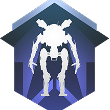

## Heya 👋
Find me here: [takyon.ml](https://takyon.ml)
<table>
  <tr>
    <td width=50%>  

**I’m currently working on:**
-   **Titanfall 2** Northstar **mods** with **Squirrel**              
- 👨‍💻 Learning **Reverse Engineering** 
- 📖 Learning **C++**
      
**My Languages:**  

      
      
**Support me :)**  

    </td>
    <td width=50%>

    </td>
  </tr>
</table>

<!--
**ScureX/ScureX** is a ✨ _special_ ✨ repository because its `README.md` (this file) appears on your GitHub profile.

Here are some ideas to get you started:

- 🔭 I’m currently working on ...
- 🌱 I’m currently learning ...
- 👯 I’m looking to collaborate on ...
- 🤔 I’m looking for help with ...
- 💬 Ask me about ...
- 📫 How to reach me: ...
- 😄 Pronouns: ...
- ⚡ Fun fact: ...
-->
